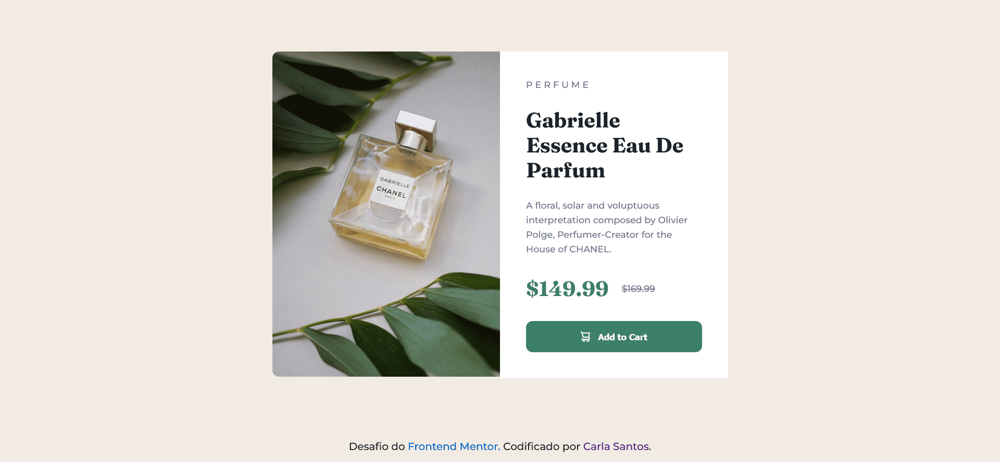

# Frontend Mentor - solução de componente de cartão de visualização do produto.

Esta é uma solução para o [desafio do componente do cartão de visualização de produto no Frontend Mentor](https://www.frontendmentor.io/challenges/product-preview-card-component-GO7UmttRfa). Os desafios do Frontend Mentor ajudam a melhorar nossas habilidades de codificação criando projetos realistas.

## Índice

- [Frontend Mentor - solução de componente de cartão de visualização do produto.](#frontend-mentor---solução-de-componente-de-cartão-de-visualização-do-produto)
  - [Índice](#índice)
  - [Visão geral](#visão-geral)
    - [O desafio](#o-desafio)
    - [Screenshot](#screenshot)
    - [Links](#links)
  - [Meu processo](#meu-processo)
    - [Desenvolvido com](#desenvolvido-com)
  - [Autor](#autor)
  - [Agradecimentos](#agradecimentos)

## Visão geral

### O desafio

Os usuários deverão ser capazes de:

- Ver o layout ideal dependendo do tamanho da tela do dispositivo.
- Ver os estados de foco para elementos interativos.

### Screenshot

### Links

- Site: [Veja ao vivo](https://carla-santos-frontend-mentor.netlify.app/1-product-preview-card-component-main/index.html)

## Meu processo

### Desenvolvido com

- Marcação semântica HTML5
- CSS custom properties
- Flexbox
- CSS Grid
- Mobile-first workflow

## Autor

- Frontend Mentor - [@carla-santos](https://www.frontendmentor.io/profile/carla-santos)

## Agradecimentos

- Google Fonts
